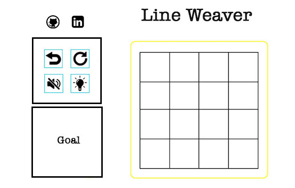

# Line Weaver

[Live Link](https://github.com/xiaoyuny/javascript-project)

## Background and Overview

`Line Weaver` is a mathematical brain teaser that challenges the player to weave a single line into wonderful patterns. It is built entirely in JavaScript and utilizes Canvas to interact with the player.

## Functionality and MVP Features

- [ ] View board and goals

- [ ] Interact with the game by dragging the line to reach the goal status

## Architecture and Technologies

- Vanilla `JavaScript` for overall structure and game logic
- `HTML5 Canvas` for DOM manipulation and rendering
- `Web Audio API` for sound generation, processing and control
- `Webpack` to bundle and serve up the various scripts
- `React.js` for basic page structure and functionality

**Main files**

- `game.js` main structure of the canvas and center of game logic
- `board.js` responsible for rendering the board
- `player.js` receives input and outputs reaction

**Wireframe**

## Implementation Timeline

**Day 1:**

- [x] Complete basic page skeleton

- [x] Complete board design and rendering

**Day 2:**

- [x] Draw different types of vertex

- [x] Attach event listeners

- [x] Implement edge-clicking related logic

**Day 3:**

- [ ] Implement detect nearby vertex and attach edges related logic

- [ ] Implement edges conflict related logic

**Day 4:**

- [ ] Finish main game logic

- [ ] Implement levels, Write AI logic to populate levels

**Weekend (Day 5 & 6):**

- [ ] Complete MVPs an iron out project

- [ ] Style page

- [ ] Test, debug, polish and deploy

**Bonus Features**

- [ ] Hints

- [ ] Audio

- [ ] Scoreboard
