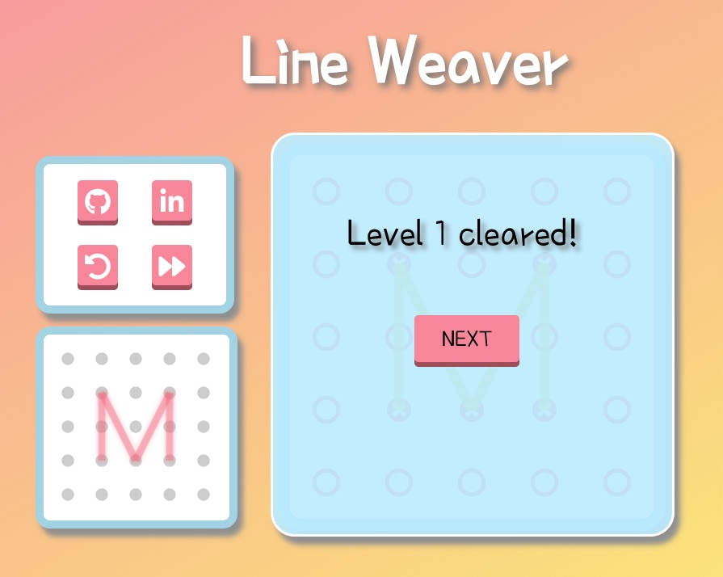

# Line Weaver

### ...[Live Link](https://xiaoyuny.github.io/Line-Weaver/)...

## Background and Overview

`Line Weaver` is a mathematical brain teaser that challenges the player to weave a single line into wonderful patterns. It is built entirely in `JavaScript` and utilizes `Canvas` to interact with the player.

## Architecture and Technologies

- Vanilla `JavaScript` for overall structure and game logic
- `HTML5 Canvas` for DOM manipulation and rendering
- `Webpack` to bundle and serve up the various scripts

## Functionality and Features

- Users can view board and patterns
- Users can interact with the game by dragging and weaving the line according to the provided pattern to clear a level
- Users can undo last move and reset the current level

## UI

`Line Weaver` uses simple and easy to understand UI design with delightful colors.

 

## Implementation


**On-edge-click detection**


| **_a_** × **_b_** | = 0 <=> the area formed by edge `a` and `b` is 0 <=> edge `a` and edge `b` are on the same line <=> vertex `A`, `O`, `B` are on the same line.

In the game, edges have thickness, therefore the corss product can fall in a range instead of being a single value, and vertex `O` also needs to be between `A` and `B`.

```Javascript
  selectedEdge(x, y) {
    for (let i = 0; i < this.fullVertex.length; i++) {
      if (i === this.fullVertex.length - 1) continue;
      const vertex1 = this.fullVertex[i];
      const vertex2 = this.fullVertex[i + 1];

      const maxX = vertex1.x > vertex2.x ? vertex1.x : vertex2.x;
      const minX = vertex1.x < vertex2.x ? vertex1.x : vertex2.x;
      const maxY = vertex1.y > vertex2.y ? vertex1.y : vertex2.y;
      const minY = vertex1.y < vertex2.y ? vertex1.y : vertex2.y;

      if (
        (x - vertex1.x) * (y - vertex2.y) - (x - vertex2.x) * (y - vertex1.y) >=
          -2000 &&
        (x - vertex1.x) * (y - vertex2.y) - (x - vertex2.x) * (y - vertex1.y) <=
          2000 &&
        ((x < maxX && x > minX) || (y < maxY && y > minY))
      ) {
        this.index = i;
        return [vertex1, vertex2];
      }
    }
  }
```

**Edge crossing determination**

In the following image,
Edge `a` - formed by vertex `A` and `B`,
Edge `b` - formed by vertex `C` and `D`.

If `a` and `b` will not cross, following the order `A` -> `C` -> `B` -> `D`, will form a convex quadrilateral,
on the contratry, if `a` and `b` will cross, this action will form a crossed quadrilateral.

This is the basic concept of how `Line Weaver` checks edge conflicts.

 

```Javascript
  hasConflicts(edgeVertex1, edgeVertex2) {
    const result = [];
    for (let i = 0; i < this.fullVertex.length - 1; i++) {
      if (i === this.index) continue;
      const boardVertex1 = this.fullVertex[i];
      const boardVertex2 = this.fullVertex[i + 1];

      const vertexArray = [
        edgeVertex1,
        boardVertex1,
        edgeVertex2,
        boardVertex2
      ];
      const crossProduct = [];

      for (let i = 0; i < 4; i++) {
        const vertex1 = vertexArray[i];
        const vertex2 = vertexArray[(i + 1) % 4];
        const vertex3 = vertexArray[(i + 2) % 4];

        crossProduct.push(
          (vertex3.x - vertex1.x) * (vertex3.y - vertex2.y) -
            (vertex3.x - vertex2.x) * (vertex3.y - vertex1.y)
        );
      }

      if (
        crossProduct.every(value => value > 0) ||
        crossProduct.every(value => value < 0) {
          result.push(true);
        } else if (...) {
        ......
```

**Level clear determination**

Breakdown both players' edges and solution edges into edges as small as possible, then compare to make sure edges won't be different because of the vertexes on them.


In code:

```Javascript
  levelCleared() {
    let playerEdges = [];
    for (let i = 0; i < this.gameView.fullVertex.length - 1; i++) {
      const values = [
        this.gameView.fullVertex[i],
        this.gameView.fullVertex[i + 1]
      ].map(vertex => [(vertex.x - 45) / 90, (vertex.y - 45) / 90]);

      playerEdges = playerEdges.concat(
        this.edgeBreakdown(...values[0], ...values[1])
      );
    }

    let computerEdges = [];
    for (let i = 0; i < this.level.goal.length; i++) {
      computerEdges = computerEdges.concat(
        this.edgeBreakdown(...this.level.goal[i][0], ...this.level.goal[i][1])
      );
    }

    if (playerEdges.length != computerEdges.length) {
      return;
    }

    for (let i = 0; i < computerEdges.length; i++) {
      let found = playerEdges.reduce(
        (acc, el) => acc || el.equals(computerEdges[i]),
        false
      );
      if (!found) {
        return;
      }
    }

    this.renderModal();
  }

  edgeBreakdown(x0, y0, x1, y1) {
    const result = [];
    const dx = x1 - x0;
    const dy = y1 - y0;

    for (let j = 4; j >= 1; j--) {
      if (dx % j == 0 && dy % j == 0) {
        for (let k = 0; k < j; k++) {
          result.push(
            new Edge({
              vertex1: new Vertex({
                x: x0 + k * (dx / j),
                y: y0 + k * (dy / j)
              }),
              vertex2: new Vertex({
                x: x0 + (k + 1) * (dx / j),
                y: y0 + (k + 1) * (dy / j)
              })
            })
          );
        }
        return result;
      }
    }
  }
```

## Possible future features

- Hints
- Audio
- Generate levels automatically
- Mobile-friendly version
